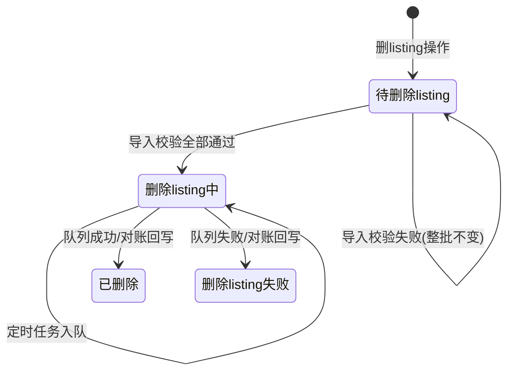

# 已审核 listing 删除导入

## 1. 修改纪要

| 日期 | 版本 | 修改人 | 主要修改点 |
|---|---|-----|---|
| 2026-06-08 | v1.0 | （待填） | 初稿：导入校验、整批失败、状态流转、队列与前台文案 |

## 2. 调研纪要

| 日期 | 业务部门 | 角色 | 调研对象（干系人） | 调研内容和结论 |
|---|----|---|-----|----|
| 待补充 | | | | |

## 3. 业务背景和价值

**业务背景**：删词处理流程中，销售/运营对「待删除 listing」数据完成业务审核后，需通过导入方式批量提交删除任务。后台采用删 listing 队列异步执行，完成时间需每日监控队列，非导入当下即时完成。

**业务价值**：
- 导入前全量校验，避免部分成功导致状态不一致
- 与删 listing 队列解耦，导入接口快速响应
- 状态与日志可追溯，便于运营对账与队列监控

## 4. 需求评级

- 优先级：**P2**
- 依据说明可引用：《010 需求优先级识别制度（待执行）》

## 5. 需求概述

### 5.1 功能范围

「已审核 listing 删除导入」：用户上传 Excel/CSV，系统按 **MSKU + 店铺** 校验 listing 是否存在且状态为「待删除 listing」。**任一条不通过则整批失败**；全部通过后批量将状态改为「删除 listing 中」，由后台**定时任务**加入删 listing 队列。

### 5.2 导入规则

| 规则项 | 说明 |
|--------|------|
| 可导入范围 | 仅系统中状态为 **待删除 listing** 的数据 |
| 校验键 | **MSKU + 店铺**（联合唯一匹配 listing） |
| 校验条件 | listing 存在，且当前状态 = **待删除 listing** |
| 失败策略 | **整批失败**：任一条不匹配，**不做任何状态变更、不入队** |
| 成功策略 | 全部通过后，对应 listing 状态 → **删除 listing 中** |
| 入队时机 | 后台**定时任务**将「删除 listing 中」数据加入删 listing 队列（可重试） |
| 终态回写 | 队列执行 / 每日对账后回写 **已删除** 或 **删除 listing 失败**，并写操作日志 |

### 5.3 导入模板字段

| 字段 | 必填 | 说明 |
|------|------|------|
| MSKU | 是 | 与店铺联合匹配 listing |
| 店铺 | 是 | 与 MSKU 联合匹配 listing |
| ASIN | 否 | 辅助核对 |
| 系统 SKU | 否 | 辅助核对 |

### 5.4 状态定义

| 状态 | 含义 | 可执行操作 |
|------|------|------------|
| 待删除 listing | 已提交删 listing 意向，待业务审核导入 | 可导入；不可修改文案/保留（按列表既有规则） |
| 删除 listing 中 | 导入校验通过，已受理删除；等待入队或队列处理中 | 不可修改文案/保留/重复导入 |
| 删除 listing 失败 | 队列执行或对账失败 | 只读，按既有规则处理 |
| 已删除（终态） | 队列确认删除成功 | 只读 |

> **说明**：「删除 listing 中」≠ 已删除完成。Hover 提示：*已提交删除任务，等待队列执行；最终结果以后台处理为准。*

### 5.5 状态流转

### 5.6 前台交互

#### 导入弹窗

- 入口：工具栏「已审核 listing 删除导入」
- 展示导入规则、模板字段说明、上传区
- 点击「确认导入」触发校验

#### 校验失败

- 关闭导入弹窗，弹出**导入结果**弹窗
- 文案：**导入失败：共 N 条，M 条校验不通过。本批未做任何状态变更、未入队。**
- 表格返回错误行：**行号、MSKU、店铺、失败原因**
- 失败原因示例：
  - listing 不存在（MSKU+店铺不匹配）
  - listing 状态为「xxx」，非待删除 listing
  - 已在删除流程中（状态为删除 listing 中）

#### 校验成功

- 关闭导入弹窗，弹出**导入结果**弹窗 + Toast
- 主文案：**校验通过，已提交删除 N 条。**
- 补充说明：状态已更新为「删除 listing 中」，系统将**定时**加入删除 listing 队列；实际删除完成以后台队列执行及对账为准。
- Toast：**校验通过，N 条已提交删除，系统将加入删除 listing 队列**

#### 操作日志

- 导入成功（按行）：操作内容 = **导入删除 listing**，备注 = **校验通过，已提交删除**
- 队列回写（按行）：操作内容 = **队列执行完成**，备注 = **已删除** / **删除失败：{原因}**

### 5.7 后台处理

1. **同步阶段（导入接口）**：解析文件 → 全量校验 → 失败则返回错误明细；成功则事务内批量更新状态为「删除 listing 中」
2. **异步阶段（定时任务）**：扫描「删除 listing 中」且未入队/需重试的记录 → 加入删 listing 队列 → 记录入队结果（失败可重试，纳入队列日监控）
3. **回写阶段（队列消费 + 日对账）**：更新终态与操作日志

### 5.8 异常与边界

| 场景 | 处理 |
|------|------|
| 导入文件为空 | 提示「文件无有效数据」 |
| 重复导入（已在删除 listing 中） | 校验失败，整批失败，错误原因「非待删除 listing」 |
| 校验通过但入队失败 | 保持「删除 listing 中」，定时重试；队列监控可见 |
| 并发：导入校验期间他人操作同一 listing | 以校验时刻 DB 状态为准；通过后立即锁状态 |

## 6. 风险描述

- a) 整批失败策略在大批量、少量错误时可能需要用户多次修正重导
- b) 「删除 listing 中」与队列实际进度可能存在延迟，需队列监控与对账机制配套
- c) 前台「已加入队列」语义须与定时入队节奏一致，避免用户误以为已删除完成

## 7. 验收标准

#### 5.1 验收时间

默认：**需求上线后 5 个工作日内**验收完成。

#### 5.2 验收标准（OCSM）

| 角色 | 目标 | 挑战 | 策略 | 度量 |
|---|---|---|---|---|
| 运营/销售 | 批量提交已审核删 listing | 误导入、状态混乱 | MSKU+店铺全量校验、整批失败 | 错误行可导出/展示；成功行状态正确 |
| 技术/运营 | 队列可监控、可对账 | 入队失败、回写延迟 | 定时入队+重试+日对账 | 队列监控有积压/失败指标；终态可回写 |

**其他描述**：
- a) 菜单、页面内容展示正常
- b) 权限正常
- c) 导入成功/失败流转、操作日志正常
- d) 状态与队列回写数据正常

#### 5.3 服务验收标准

1. 导入接口：整批校验、失败返回明细、成功批量改状态
2. 定时入队任务：可配置周期、失败重试、监控告警
3. 队列回写：终态与日志一致

## 8. 其他

- 原型页面：`qinquan-jinshou/qinquan-chuli-list/index.html`（含校验成功/失败演示）
- 依赖：删 listing 队列、队列日监控、listing 状态表、操作日志
